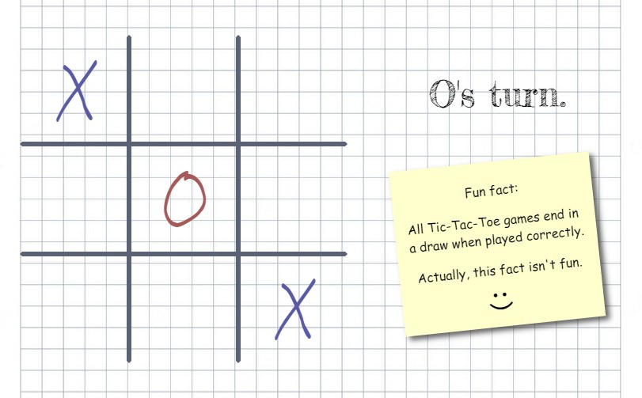

# Simple Tic Tac Toe Game

> Play Tic Tac Toe

---

---

## Live Demo

Live demo here: :arrow_right: [TicTacToe](https://react-simple-tictactoe.netlify.app/)

## Description

Tic Tac Toe, written in React, used grid, flex(box) and CSS media query. Skeleton created via [Vite](https://vitejs.dev/)

## ⌨ Installation

| Command                                                      | Action                                       |
| :----------------------------------------------------------- | :------------------------------------------- |
| `git clone https://github.com/ozhasta/react-tic-tac-toe.git` | Clone the repo                               |
| `cd react-tic-tac-toe`                                       | Change directory to root of project          |
| `npm install`                                                | Install dependencies                         |
| `npm run dev`                                                | Start local development server               |
| `npm run build`                                              | Build your production site to `./dist/`      |
| `npm run preview`                                            | Preview your build locally, before deploying |
